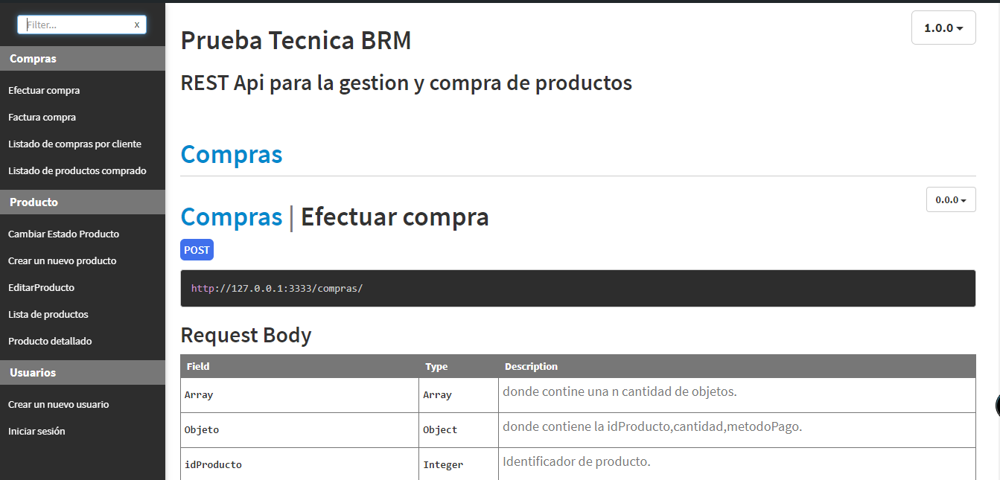
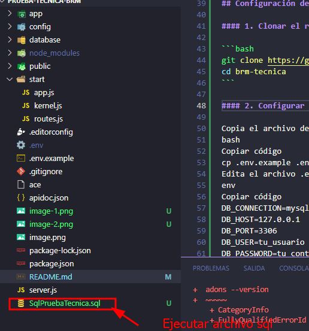
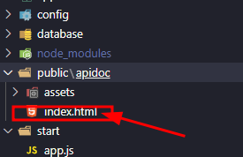
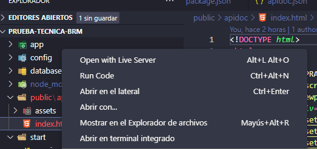
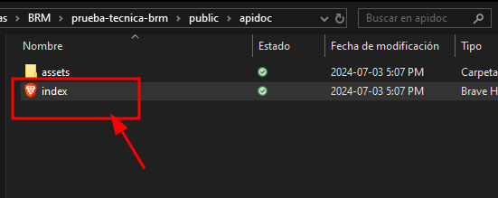

# Brm Compra

## Introducción

Este proyecto consiste en el desarrollo de una API REST para la gestión y compra de productos en un inventario. La API fue implementada utilizando el framework AdonisJS v4.1.0 y la base de datos MySQL (MariaDB), ofreciendo una solución robusta y escalable para el manejo de usuarios y productos.

## Tecnologías Utilizadas

- _AdonisJS_: Un framework de Node.js que proporciona una estructura sólida para el desarrollo de aplicaciones web y APIs.


- _MySQL (MariaDB)_: Un sistema de gestión de bases de datos relacional utilizado para almacenar la información de usuarios y productos.


## Requisitos Mínimos para Ejecutar el Proyecto

### 1. Sistema Operativo

- **Windows 10/11**
- **macOS Catalina o superior**
- **Ubuntu 20.04 o superior**

### 2. Software Necesario

- _Node.js_: Versión 8 o superior.

  - Puedes descargarlo desde [Node.js Official Site](https://nodejs.org/).

- _NPM_: Versión 3 o superior.

- _AdonisJS CLI_: Instalado globalmente.

  - Se puede instalar usando npm:
    ```bash
    npm i -g @adonisjs/cli
    ```

- _MySQL (MariaDB)_: Versión 10.5 o superior.
  - Puedes descargarlo desde [MariaDB Official Site](https://mariadb.org/download/).

## Configuración del Proyecto

### 1. Clonar el repositorio:

```bash
git clone https://github.com/JuliAleja/brm-tecnica.git
cd brm-tecnica
```

### 2. Instalacion de dependencias:

```bash
npm install
```

### 3. Configurar el archivo .env:

- **Copia el archivo de ejemplo**:

```bash
cp .env.example .env
```

- **Edita el archivo .env con las credenciales de tu base de datos MySQL (MariaDB)**:

```bash
DB_CONNECTION=mysql
DB_HOST=127.0.0.1
DB_PORT=3306
DB_USER=tu_usuario
DB_PASSWORD=tu_contraseña
DB_DATABASE=brm //IMPORTANTE: Dejar el nombre tal cual ,si vas ejecutar el archvo sql.
```

### 4.Configuracion de Base de Datos:

#### Opcion 1: Ejecutar SQL

- **Usar un gestor de base de datos MySQL Workbench**

* **Abre el gestor de base de datos MySQL Workbench y conéctate a tu servidor MySQL.**

* **Abre el archivo SqlPruebaTecnica.sql en MySQL Workbench.**

  

* **Ejecuta el script seleccionando todo el contenido del archivo y presionando el botón "Ejecutar" (icono de rayo).**

#### Opcion 2: Migracion de la base de datos

- **Ejecuta las migraciones para configurar la base de datos**:

```bash

adonis migration:run

```

### 5. Ejecución del Proyecto

- **Para iniciar el servidor, ejecuta el siguiente comando**:

```bash
adonis serve --dev
```

- **El servidor debería estar corriendo en http://127.0.0.1:3333**.

### 6. Ejecucion de ApiDocs

Para acceder a la documentación del proyecto:

- **Aqui se ecuentra la documentacion del proyecto**

  

* **Dale clic derecho y selecciona "Mostar en el explorador de archivos"**

  

* **Abre el archivo index.html**
  

* **Esto te llevará a la interfaz de ApiDocs donde podrás explorar la documentación detallada del proyecto.**
